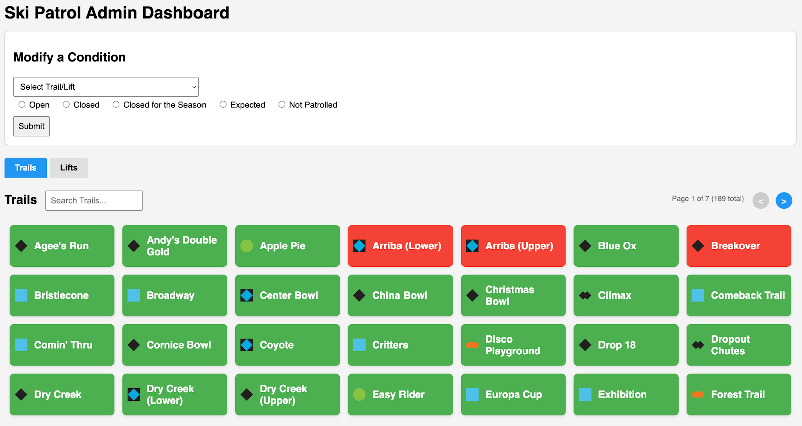
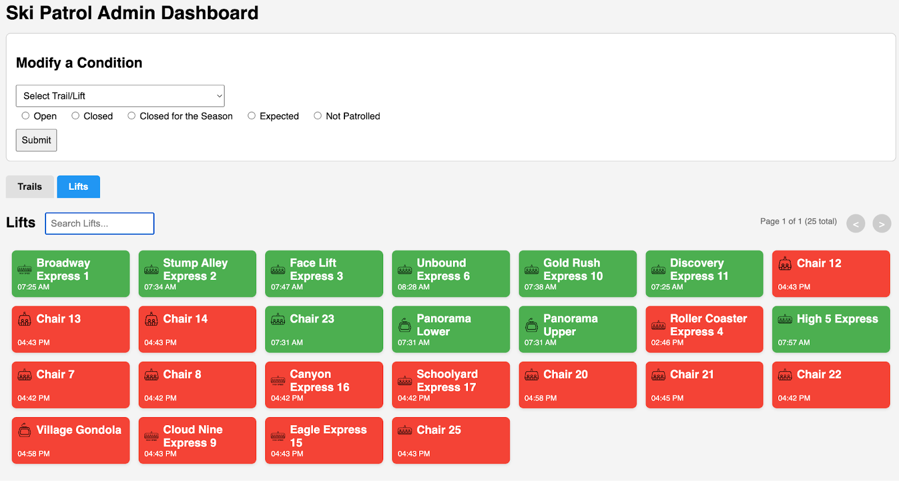
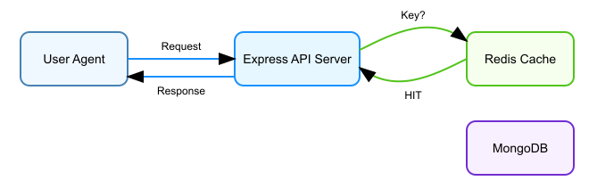
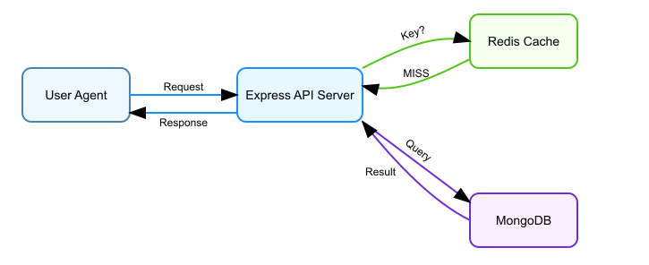

# Project 2

## Computer Science 144 – Prof. Rosario 
*Due Sunday,  May 11, 2025 11:59 PM on Gradescope*

## APIs, Databases, Caching and Web Storage

In this project, you will practice several of the concepts we have been discussing in lecture. In particular:

1. Creating a solid end-to-end REST API that is used to populate a simple web page.  
2. Gaining experience with GraphQL and tRPC (TypeScript) by implementing a few resolvers and procedures.  
3. Using MongoDB, via an ODM, as a persistent store backing the API  
4. Implementing a common (web) architecture using a caching layer applied to the REST API only.  
5. Implementing local or session storage to maintain state on a simple webpage using HTML5

**While you will do a little bit of web development in this project, that is not the overall goal. The web development is used to test your REST API and show the full integration of technologies.**

***Note that this is a new project for this year, given my intention to focus more on backend and deployment. Please let us know if there are any issues, and we thank you in advance for your patience. Try to have fun with this project. If you want to implement additional functionality for your own learning, please do so and let us know in the README.*** 

### Materials

The Github repository [here](https://github.com/Prof-Rosario-UCLA/ucla-cs144-project2) (note this changed 5/2 7:11pm) provides the skeleton code for this project and is defined as below. **You should issue a `git pull` in your repository often in case we make changes to the code. If you fork, please only do so into a private repo.**

1. `api.js` \- the main entrypoint for the Express server. It is a typical JavaScript file, but since TypeScript is mixed into this Node project, you will need to make some changes once you get to tRPC. It provides a "switchboard" to different APIs: REST, GraphQL and tRPC depending on the request path.  
2. `utils/mongodb.js` \- contains functions to read from MongoDB using Mongoose. You will write code here.  
3. `utils/redis.js` \- contains functions to read from and write to a Redis cache. You will write code here.  
4. `rest/` \- is a directory containing all of the files necessary to complete the REST API. It contains subdirectory `routes` containing the proper routes for the lift and trail resources. You will write code here.  
5. `models/` \- contains the Mongoose schema and model definitions. You do not need to write any code here since we are not writing to the MongoDB.  
6. `graphql/` \- contains all of the files necessary to complete the GraphQL API. It contains a schema file for types, a resolvers file containing the functions to resolve each field of each object and an `index.js` file that ties the two together. Note that if our API server were *only* a GraphQL API server, the `index.js` file would be combined into the `api.ts` file at the root. You will write code here. Note that you will only write a couple of resolvers here to give you experience with GraphQL. You will use `curl` (or equivalent to test).  
7. `trpc/` \- contains all of the files necessary to complete the tRPC API. It contains the data **types** in the `types` directory, the **services (RPC)** in the `services` directory, **routers** in the `routers` directory and a **client** used for testing, in the `client` directory. There is an empty directory called **`procedures`** which is optional. In larger APIs, the procedures are separated into files in this directory. Ours is simple enough that we implemented them in the routers. You will write code here. Again, you will only write a few procedures.  
8. `public/index.html` \- contains a simple responsive web page. You will use this to test your REST API, though you are also encouraged to use `curl` or Postman to do so. You will modify this page lightly (see the TODOs).

## Setting Up The Dev Environment

Due to the way this project was implemented, it's possible to complete it on your laptop. If you choose to use your laptop, please **stop** your GCE instance until you need to use it.

It is worth practicing on your GCE instance to get real life experience communicating with a server over the Internet. 

Once you have cloned the skeleton, run the following command:

`npm install`

This installs the necessary dependencies for Express, REST, GraphQL, tRPC and MongoDB/Redis drivers as well as Mongoose.

We have provided you with a `project.json` file that contains some special commands (take a look\!). While working on JavaScript only tasks (1, 2, 3, 5), execute

`npm run js`

to run the Express server. Once you start implementing the tRPC code, you will need to uncomment the following in `api.js`

1. Lines 15 and 16  
2. Lines 47-50  
3. Lines 55-57  
4. Line 72

Then, to compile and then execute the server, use:

`npm run ts`

Note for the JavaScript part, you can also just run `node api.js` in the root of the project. In the TypeScript part, you can run `tsc` followed by `node dist/api.js`. You may need to delete the `dist` directory before executing this command. Note that there may be other ways to do this. Feel free to let us know.

You can [run your server in the background using pm2](https://betterstack.com/community/guides/scaling-nodejs/pm2-guide/). When you change your code, you simply run `pm2 reload name-of-server`. There are also ways to [run Express using Nginx](https://dev.to/jsstackacademy/deploy-nodejs-application-using-nginx-3jhh) as a reverse proxy. In any case, the Node project needs to execute correctly in a standard Node project environment.

The beauty of Node/Express and Mongoose is that they encourage good software engineering practices and allow you to choose your own adventure without worrying about where you start. Below is a general strategy for you.

## Task 1: Create the MongoDB Queries

For MongoDB queries, you must use Mongoose. For Redis, you can just use native function calls via the Redis driver. These will be implemented in `utils/mongodb.js` and `utils/redis.js`.  You can hold off on Redis for a bit if you want to wait until you implement the caching layer.

For MongoDB, you need to implement several functions using Mongoose, and you will communicate over the network to Professor's MongoDB server. There is also a sample MongoDB dump [here](https://github.com/Prof-Rosario-UCLA/ucla-cs144-project2/tree/main/sample) (check again on 5/3) that you may wish to load into **your** MongoDB instance for testing. See the README file for instructions. You can then set the `DEBUG` flag in the `dbconfig.js` file to switch between your local MongoDB and the production server. The username for the production server is `cs144` and the password is `bruinz4lyfe`. I realize this is insecure, but that's for us to worry about. Authentication on MongoDB would delay this spec.

1. `getLatestBatch(type)` fetches the latest batch of lift or trail information from MongoDB. At the root level, there is some information about the type of object (`TrailBatch` or `LiftBatch`), and a timestamp when the data was fetched with the scraper. There is also an array of lifts and/or trails. **This data structure must be cached (later).**  
2. `getNearestBatch(type)` fetches the most recent batch given some timestamp. For example, there is a batch from 9am on 4/1/25 (the past), and you query for 11am on 4/1/25 and there are no batches from 9am to 11am, the 9am batch will be fetched. This is useful for true ski/board aficionados that want to collect historical data about lifts and trails.

**To manage expectations**: **a significant portion of time is spent on this task.**

## Task 2A: Implement the REST API Endpoints

There are TODOs in the files `rest/routes/lift.js` and `rest/routes/trail.js` for you to fill in. Most of the code scaffolding is provided for you but you will also need to write to the API (the cache). We suggest coming back to that later.

Once you are finished, you should test your API endpoints using cURL or Postman to check the general structure and see if there are any bugs.

**To test your MongoDB implementation on the production server, see the previous section.**

**To manage expectations**: **a significant portion of time is spent on this task.**

## Task 2B: Add the Information to the Basic Webpage

Now that your REST API is complete, use it to populate the basic webpage with the proper information using a modern method (discussed in lecture). See the TODOs in `public/index.html`.

Note that there may be something misleading here *depending on how you write data from the form*. You may actually figure out a better endpoint name than the one that seems to have been left in the HTML code.

Below are two screenshots showing an example of what the webpage should display. Note that it will vary with time of day. Outside of the hours of 7:30am to 2pm, most lifts and trails will be listed as `CLOSED` or `EXPECTED`.

TODO(RRR): Render a screenshot from the solutions of what the page should look like at any given point of the day.

Trails:  

Lifts:  

**You may also wish to knock out Task 6 while you're at it.**

TODO: Provide students a static API return so students can test their work deterministically.

## Task 3: Implement a Couple of GraphQL Resolvers

There are TODOs in `graphql/schema.js` and `graphql/resolvers.js`. 

Note that if you use good software engineering hygiene, there is very little to do here.

To test this API, you will only need to use cURL or Postman.

TODO: Provide a unit test for students.

## Task 4: Implement a Couple of tRPC Procedures

There are TODOs in the files in the `trpc` directory. 

Note that if you use good software engineering hygiene, there is very little to do here but note that getting the Typescript build can be tricky. We have handled most of that for you.

*Note that you will need to uncomment some lines in the `api.js` file and rename the file to `api.ts`.* 

*Then to build your code, execute*

`npm run ts` at the root level of the project.

To run it manually:

`npx tsc; node dist/api.js`   (yes, `api.js`)

To test your API, you *may* need to modify the file `trpc/client/client.js`.

TODO: Try to give students some kind of unit test here.

## Task 5: Implement the Caching Layer

**NOTE: You will use Redis on your own GCE instance, or your laptop. Only MongoDB uses the class server.**

You will now integrate the caching layer to your REST API. Typically, `GET` requests do not have side effects; however, in the HTTP standard, this refers to side effects on the web server itself. The side effect we implement here is in a cache, not the webserver (though it is possible to do it with Express middleware). The architecture looks like the following:

  
A *hit* means the key was found in the cache and the value will be returned to the API server.

  
A *miss* means that the key was not found in the cache and the API server must contact MongoDB to get the data.

You will now need to go back and add code to `utils/redis.js` to read from and write to Redis. **You will also need to revisit your REST API and update it to use this architecture.** *To be clear, you do not need to implement the caching layer on GraphQL or tRPC.* 

* On each fetch of all trails and lifts, the data should be inserted into the Redis cache with a 5 minute TTL. You may want to store all of this data as a JSON blob.  
* The simple web page refreshes every 60 seconds.

Note that while Redis is awesome, it does not support *all* of the cool things we can do in a programming language, most notably, hash within a hash (dict in a dict).

Below are examples of keys you should use for your cache based on namespaces:

`"mammoth:trail:Roma's_Glades"` 

represents the trail Roma's Glades and is a hash. It may seem that we can fetch this key and get all of the information about this trail, but we cannot. If we want to do that, you need to pass the property/key (we are being vague here, but you should consult the documentation for the proper data structure commands to use here).

You can fetch *all* of the data for all trails (or similarly for a lift) using:

`"mammoth:trail:all"` 

Again, this is the cache key. You need to figure out the appropriate Redis command (hint, use `type`). Similarly, you can fetch each individual property by replacing `all` with the proper key. **You are responsible for creating the proper objects in Redis. Read the TODOs carefully.**

Note that if you used good software engineering hygiene, this section should not be as challenging as the MongoDB tasks.

Aside:

This particular architecture is called a *look-aside cache.* Another strategy, called *look-through* caching, requires that an application server (e.g. Nginx) receives a request and *knows* how to then pass the request to the database. The difference between the two is subtle. Basically in look-through caching, the cache itself calls the database rather than the client (Express API server in this case). Look-aside caching is far more common for developers. Look-through caching is used more at the enterprise level.

As you may know, Professor is obsessed with caching. It is simple (well, sort of), helps speed up processing quite a bit, and imposes quite a few interesting challenges in software and systems development. By using a cache, we tend to tradeoff strong consistency (CP) for higher availability (AP) under a network partition event. This paper (optional) is a fascinating read that discusses how Facebook tried/tries to provide a higher consistency "guarantee" in a large distributed system.

## Task 6: Cooldown \- Web Storage API

We will use Web Storage API to add one last feature to the simple web page — remembering  which tab the user had selected, so it does not reset to the ‘Trails’ tab on the next refresh etc.

When the user visits the simple webpage, they want their "progress" saved across refreshes and tab open/close. Store which tab is currently active in HTML5 storage. Choose the correct type.

To test, switch to the Lifts tab, close the tab, refresh the page, restart the browser and check that when you visit the page again, the Lift tab is selected.

## Testing Your Work

**Task 2 \- REST API and Modification to Simple Web Page**

**Task 3 \- GraphQL**

**Task 4 \- tRPC**

**Task 5 \- Caching**

**Task 6 \- Web Storage API**

## Submitting Your Assignment

If you choose to do your development in Github please use a **private** repo. You will then submit the link to this repo on Gradescope. Otherwise, create a zip file, keeping the Node project structure intact.

Please remove any other unnecessary directories or files though. In particular, do not submit:

* `dist`  
* `package-json.lock`  
* `node_modules`

You can also use the `npm run prepare-dist` command. To test your submission, you can create a new directory and `cp -r` your files to it. Then run

`npm install; npm run ts`

### README.md

You must create a `README` or `README.md` (Github) in the mammoth root directory. You can leave this file blank. If you run into any problems, please specify them here. If anything is special to grade your project, please also provide that information in the README file.

